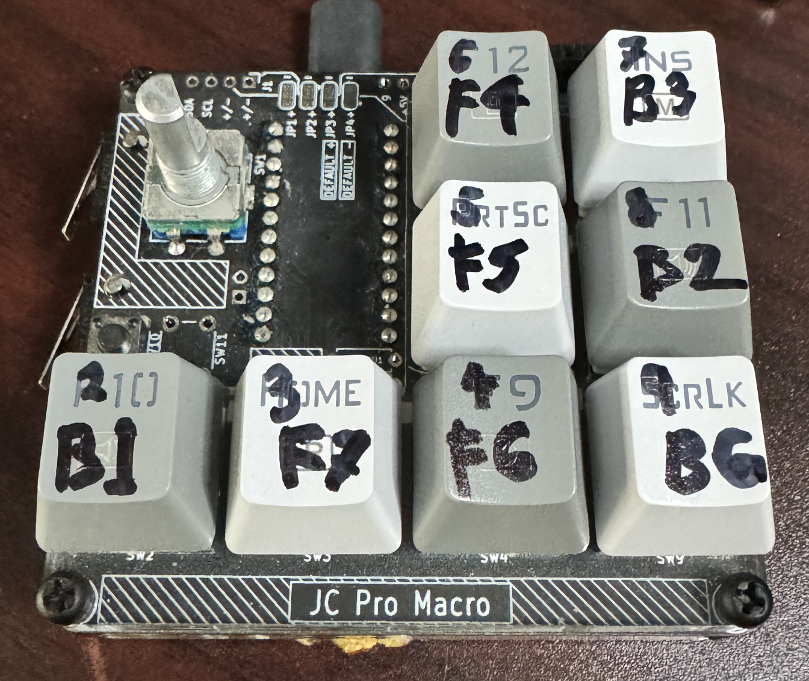
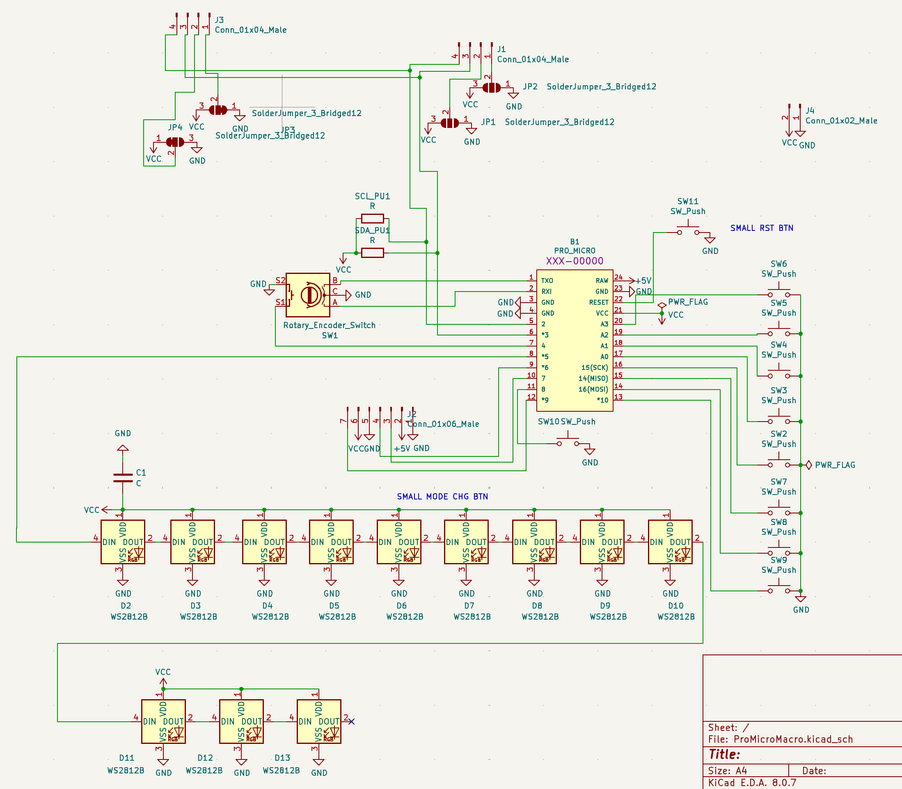

Experimental QMK firmware - Hex file is somewhat stable, while definition in jcpm2test may be further along.

As of now, all switches and encoder work with three layers set up. Underlighting active. OLED active.

Need to modify info on OLED. See the setup folder for instructions on how to install and modify this firmware.

Above image: Keycaps labeled with ATmega32U4 pin numbers where each is connected (e.g. B1). These pin numbers are
needed for QMK definition. Below is a schematic which should be largely correct for the JCPM2s out there today.

